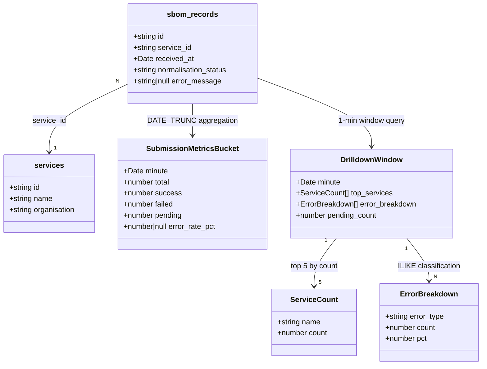

# REASONS Canvas: OB-401 — Real-Time SBOM Submission Monitoring Dashboard

---

## Requirements

Provide real-time visibility into SBOM submission health — volume trends and error rates — so ops teams can detect incidents and diagnose failures without log parsing.

Boundary: In scope — `/monitoring` route with two line charts (submission volume per minute, error rate %), 30s polling, drill-down pane showing top 5 services and error type breakdown per minute, error type tooltips, tablet-responsive layout. Out of scope — alerting/notifications, >30-day historical analysis, configuration UI, data retention.

Business value: Reduce MTTD for submission health issues from hours to seconds; enable data-driven capacity planning; support rapid incident detection.

---

## Entities

`SubmissionMetricsBucket` and `DrilldownWindow` are TypeScript interfaces — not DB tables. `normalisation_status` values: `'pending' | 'complete' | 'failed'` only.

---

## Approach

1. Solution strategy:
   - New Express router `monitoringRouter(pool)` mounted at `/monitoring`. GET `/` renders `monitoring.njk` with 24h initial metrics embedded. GET `/api/metrics` serves JSON metric buckets for polling. GET `/api/drilldown?minute=<iso>` serves drill-down data for clicked minute.
   - Frontend: `<script type="module" nonce="{{ cspNonce }}">` with 30s `setInterval` polling `/api/metrics`; Chart.js initialised with initial data from inline JSON; click handler on volume chart calls `/api/drilldown`.

2. Data access:
   - `getSubmissionMetrics(pool, windowHours)` → `SubmissionMetricsBucket[]`: `DATE_TRUNC('minute', received_at)` GROUP BY over `sbom_records`, last N hours. Returns one bucket per minute.
   - `getDrilldownData(pool, minute)` → `DrilldownWindow`: two queries — (a) top 5 services JOIN with `services.name`, (b) `CASE WHEN error_message ILIKE '%rate limit%' THEN 'rate_limit' ...` classification grouped by type.

3. Error handling:
   - Route handlers: `try/catch` — `res.status(500).json({ error: 'Internal server error' })` on DB errors; never expose stack traces or DB error messages.
   - `/api/drilldown` validates `minute` query param — `400` if missing/invalid ISO string.

4. Security:
   - `requireAuth()` applied at mount, same as `/dashboard`. All sub-routes protected.
   - Chart.js loaded via `<script>` with `nonce="{{ cspNonce }}"`. CDN (`https://cdn.jsdelivr.net/npm/chart.js`) added to `scriptSrc` in Helmet CSP config. If blocked, serve from `public/javascripts/`.
   - All SQL uses parameterised queries — no string interpolation.

---

## Structure

### Dependencies (file → file)
1. `src/db/monitoringQueries.ts` depends on `pg` (Pool)
2. `src/server/routes/monitoring.ts` depends on `src/db/monitoringQueries.ts`
3. `src/server/views/monitoring.njk` extends `src/server/views/layout.njk`
4. `src/server/app.ts` imports `src/server/routes/monitoring.ts`

### Layered responsibilities
1. `src/db/monitoringQueries.ts`: raw SQL aggregation — bucket data and drill-down data
2. `src/server/routes/monitoring.ts`: HTTP layer — render view, serve JSON endpoints
3. `src/server/views/monitoring.njk`: rendering, polling JS, chart init, drill-down panel

### New files
- `src/db/monitoringQueries.ts`: query functions + TS interfaces
- `src/db/monitoringQueries.test.ts`: unit tests with mocked pool
- `src/server/routes/monitoring.ts`: router factory
- `src/server/routes/monitoring.test.ts`: supertest route tests
- `src/server/views/monitoring.njk`: dashboard view

### Modified files
- `src/server/app.ts`: import + mount `monitoringRouter`
- `src/server/views/layout.njk`: add "Monitoring" nav link

---

## Operations

### [Test] Write failing tests for `getSubmissionMetrics`
- File: `src/db/monitoringQueries.test.ts`
- Test framework: jest 30, ts-jest
- Setup: `const mockPool = { query: jest.fn() } as unknown as Pool`
- Test cases:
  - happy path: `pool.query` returns 3 rows with `minute`, `total`, `success`, `failed`, `pending`, `error_rate_pct` — expect result array matches shape as `SubmissionMetricsBucket[]`
  - zero rows: `pool.query` returns empty — expect `[]`
  - null `error_rate_pct`: row with all-pending bucket — expect `error_rate_pct: null`
- Tests MUST fail before implementation exists

### [Impl] Create `getSubmissionMetrics`
- File: `src/db/monitoringQueries.ts`
- Signature: `async function getSubmissionMetrics(pool: Pool, windowHours: number): Promise<SubmissionMetricsBucket[]>`
- Logic:
  1. Query `sbom_records` with `WHERE received_at >= NOW() - $1::interval` (param: `${windowHours} hours`)
  2. `DATE_TRUNC('minute', received_at)` GROUP BY with `COUNT(*) FILTER` for each status
  3. `ROUND(failed::numeric / NULLIF(complete + failed, 0) * 100, 1)` for `error_rate_pct`
  4. Return `result.rows` cast to `SubmissionMetricsBucket[]`

### [Test] Write failing tests for `getDrilldownData`
- File: `src/db/monitoringQueries.test.ts` (extend)
- Setup: mock `pool.query` called twice (top services query, then error breakdown query)
- Test cases:
  - happy path: first call returns 3 service rows, second returns 2 error type rows — expect `DrilldownWindow` with populated fields
  - empty minute: both queries return empty — expect `{ minute, top_services: [], error_breakdown: [], pending_count: 0 }`

### [Impl] Create `getDrilldownData`
- File: `src/db/monitoringQueries.ts`
- Signature: `async function getDrilldownData(pool: Pool, minute: Date): Promise<DrilldownWindow>`
- Logic:
  1. Top 5 services JOIN with `services.name` WHERE window, GROUP BY service_id, ORDER BY count DESC, LIMIT 5
  2. Error breakdown: CASE WHEN ILIKE classification for failed records in window
  3. Pending count: COUNT WHERE pending in window
  4. Assemble and return `DrilldownWindow`

### [Test] Write failing route tests for GET `/monitoring`
- File: `src/server/routes/monitoring.test.ts`
- Setup: supertest; mock `getSubmissionMetrics` via `jest.mock`; no auth middleware in test app
- Test cases:
  - GET `/`: mocked metrics — expect `200`
  - GET `/`: mock throws — expect `500`
  - GET `/api/metrics`: mocked metrics — expect `200` JSON array
  - GET `/api/metrics`: mock throws — expect `500` JSON
  - GET `/api/drilldown?minute=2026-06-16T12:00:00.000Z`: mock returns DrilldownWindow — expect `200` JSON
  - GET `/api/drilldown` (no param): expect `400` JSON
  - GET `/api/drilldown?minute=not-a-date`: expect `400` JSON

### [Impl] Create `monitoringRouter`
- File: `src/server/routes/monitoring.ts`
- Signature: `export function monitoringRouter(pool: Pool): Router`
- Logic:
  1. GET `/`: render `monitoring.njk` with initial 24h metrics
  2. GET `/api/metrics`: JSON metric buckets
  3. GET `/api/drilldown`: validate minute param, return DrilldownWindow JSON
  4. All handlers: try/catch → 500

### [Impl] Create `monitoring.njk`
- Extends `layout.njk`; Chart.js CDN with nonce; two canvas elements; drill-down panel; 30s polling JS; responsive grid

### [Impl] Update `app.ts` and `layout.njk`
- Mount `monitoringRouter` at `/monitoring` with `requireAuth()`
- Add "Monitoring" nav link to `layout.njk`

---

## Norms

1. DB query functions: `async function name(pool: Pool, ...params): Promise<ReturnType>` — pool as first arg; `pool.query(sql, [params])`; return `result.rows` or scalar
2. Route factories: `export function nameRouter(pool: Pool): Router` — named export; `const router = Router()`
3. Route handlers: `async (req, res) => { try { ... } catch { res.status(500).json({ error: 'Internal server error' }) } }`
4. TypeScript: `strict: true`; explicit return types on all exported functions; no `as` assertions; `type` for data shapes
5. Testing: collocated `*.test.ts` in `src/**`; ts-jest preset; mock pool via `{ query: jest.fn() } as unknown as Pool`; no real DB in unit tests; supertest for route tests
6. Imports: named imports; no default exports
7. CSP nonce: `nonce="{{ cspNonce }}"` on every `<script>` and `<style>` tag
8. SQL: parameterised queries only; `NULLIF` for division-by-zero safety

---

## Safeguards

### Acceptance Criteria coverage
| AC# | AC description (verbatim from Jira) | Operations task(s) that implement it |
|-----|-------------------------------------|---------------------------------------|
| 1 | line chart shows submission count per minute, updated every 15–30 seconds, with current metrics visible within 1 minute of submission occurrence | [Impl] `getSubmissionMetrics`; GET `/api/metrics`; `monitoring.njk` 30s polling |
| 2 | dashboard shows error rate (failed submissions / total submissions × 100) as a percentage, updated every 15–30 seconds, and clearly distinguishes periods with 0% errors vs. elevated errors (e.g., red highlight >5% error rate) | [Impl] `getSubmissionMetrics` error_rate_pct; `monitoring.njk` red highlight >5% |
| 3 | detail pane opens showing: which GitHub repos contributed to the spike (top 5 by submission count), and the submission count for each repo during that 1-minute window | [Impl] `getDrilldownData` top services; GET `/api/drilldown`; `monitoring.njk` drill-down panel |
| 4 | breakdown table shows: error type, count, and percentage (e.g., "rate_limit: 23 (45%)", "validation_error: 18 (35%)", "auth_error: 10 (20%)") | [Impl] `getDrilldownData` error breakdown; `monitoring.njk` error breakdown table |
| 5 | UI remains responsive (click to drill-down takes <200ms), charts render without stutter, and no data points are dropped or delayed | Chart.js renders instantly; query at ~12 rows/min negligible |
| 6 | tooltip appears explaining the error (e.g., "GitHub API rate limit reached; submissions queued for retry") | `monitoring.njk` `title` attributes on error type labels |
| 7 | layout adapts: chart stacks vertically, text remains readable, drill-down modal is usable with touch input | `monitoring.njk` media query + GOV.UK grid |

### Functional constraints
- Polling interval: exactly 30s — `setInterval(poll, 30_000)`
- Error rate denominator: `complete + failed` only — exclude `pending`
- All-pending bucket: show "Processing" indicator rather than 0% error rate
- Drill-down click on zero-volume bucket: show "No submissions in this window"

### Security constraints
- All `<script>` and `<style>` tags MUST carry `nonce="{{ cspNonce }}"` — no inline scripts/styles without nonce
- Parameterised queries only — no string interpolation in SQL
- Chart.js CDN requires adding `https://cdn.jsdelivr.net` to Helmet `scriptSrc`
- MUST NOT expose DB error messages or stack traces in HTTP responses

### Data constraints
- `normalisation_status` values: `'pending' | 'complete' | 'failed'` only
- Error types (interim ILIKE): `rate_limit | validation_error | auth_error | timeout | unknown`
- `minute` param to `/api/drilldown`: valid ISO 8601; `400` otherwise

### Non-functional
- Page load initial data and render within 2 seconds
- Real-time updates must not add >50ms latency to backend query
- Dashboard usable for 8 hours without memory leaks
- Browser support: Chrome, Firefox, Safari (latest 2); mobile Safari on iPad

### Error handling
- MUST NOT expose internal error messages or stack traces in HTTP responses
- `/api/drilldown` MUST return `400` for missing or invalid `minute` param before any DB call
